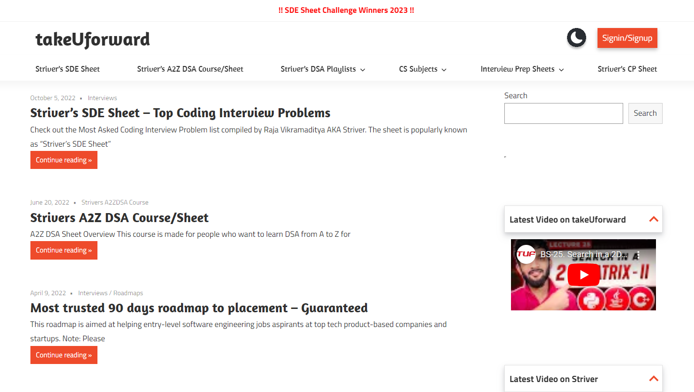
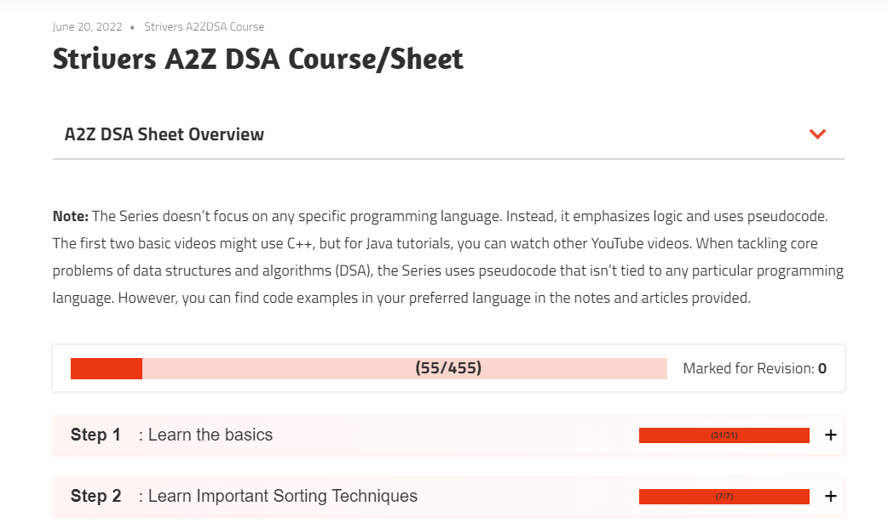

# Strivers A2Z DSA Course Solutions



Welcome to my Strivers A2Z DSA Course Solutions repository! Here, you'll find my solutions to various problems from the Strivers A2Z DSA Course Sheet. This repository serves as a collection of my progress and learning journey through the comprehensive Data Structures and Algorithms curriculum provided by the Strivers team.

## About Strivers A2Z DSA Course

The [Strivers A2Z DSA Course](https://takeuforward.org/strivers-a2z-dsa-course/strivers-a2z-dsa-course-sheet-2/) is a highly regarded course designed to equip aspiring software engineers with a strong foundation in Data Structures and Algorithms. The course covers a wide range of topics, from the basics to advanced algorithms, and includes problems that have been frequently asked in technical interviews.



## Repository Structure

The repository is organized based on the topics covered in the Strivers A2Z DSA Course Sheet. Each topic has its own directory containing solutions to problems related to that topic. The structure is as follows:

```
- Basics/
    - problem1.cpp
    - problem2.py
    - ...
- Sorting/
    - problem3.java
    - problem4.cpp
    - ...
- Arrays/
    - problem5.py
    - problem6.java
    - ...
- ... (Similar structure for other topics)
```

## Getting Started

If you're interested in exploring my solutions, follow these steps:

1. Clone the repository to your local machine:

   ```bash
   git clone https://github.com/arindal1/StriversDSASheet.git
   ```

2. Navigate to the directory corresponding to the topic and problem difficulty you're interested in.

3. Open the solution files in your preferred programming language to study the code and approach used.

4. Feel free to modify and experiment with the solutions to deepen your understanding.

## Contributing

While this repository primarily contains my solutions, I welcome contributions in the form of additional solutions, optimization techniques, or explanations. If you'd like to contribute, follow these steps:

1. Fork the repository to your GitHub account.

2. Create a new branch for your contributions:

   ```bash
   git checkout -b feature/add-solution
   ```

3. Add your solution file to the appropriate directory.

4. Commit your changes:

   ```bash
   git commit -m "Add solution to problemX"
   ```

5. Push the changes to your forked repository:

   ```bash
   git push origin feature/add-solution
   ```

6. Open a pull request on GitHub, describing the problem and your solution.

## Contact

If you have any questions or want to connect, feel free to reach out:

- GitHub: [arindal1](https://github.com/arindal1)
- LinkedIn: [Arindal](https://www.linkedin.com/in/arindalchar/)
- Strivers A2Z DSA Course: [TakeUForward](http://takeuforward.org/)

## Special Thanks to

Raj Vikramaditya aka **Striver_79** and his team.
- LinkedIn: [Raj Vikramaditya](https://www.linkedin.com/in/rajstriver/)
- YouTube: [takeUforward](https://www.youtube.com/channel/UCJskGeByzRRSvmOyZOz61ig?sub_confirmation=1)
- Other: [links](https://linktr.ee/takeUforward)

### Remember, this repository is dedicated to showcasing solutions to Strivers A2Z DSA Course problems and to fostering a collaborative learning environment. Happy coding! 🚀
